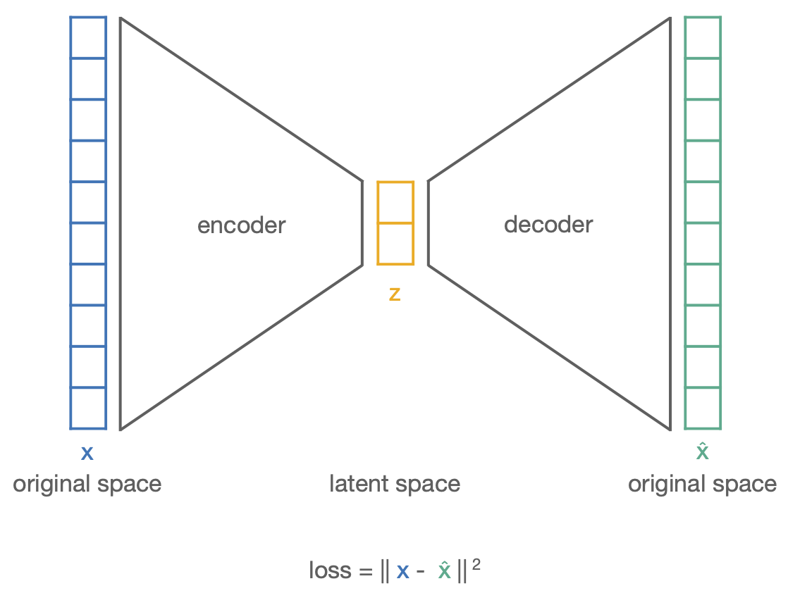
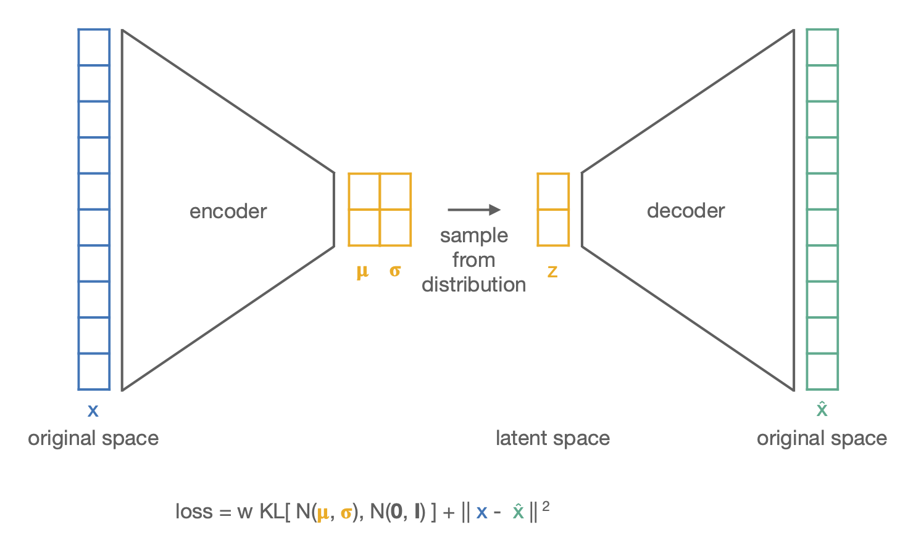

Autoencoders
============

Autoencoders are **neural networks that learn a low-dimensional latent
representation of the data, from which the original input can be reconstructed as
accurately as possible**. That latent representation is a derived,
reduced-dimensionality feature representation, a *nonlinear* alternative to the
classical feature-transformation methods, learned by a network rather than by a
fixed algorithm.

Architecture
------------

An autoencoder has two parts, trained together:

- The **encoder** is a deep network that compresses the original features into the
  latent representation, layer by layer: each layer applies a weighted sum of its
  inputs followed by a nonlinear activation.
- The **decoder** expands the latent representation back into the original feature
  space.

Training minimizes a **reconstruction loss**, which measures how closely the
decoder's output matches the original input. The width of the latent layer sets the
reduced dimensionality (e.g. 2 for visualization). The final layers are typically
linear so they can cover the full range of output values.

Applying the model to new data
------------------------------

The encoder is a **learned nonlinear mapping** from the input space to the latent
space. This is a practical advantage over methods like NMDS and t-SNE: **new data
points can be embedded directly, with no re-optimization** (a property autoencoders
share with PCA, ICA and UMAP).

The caveat is **overfitting**: autoencoders have **many more parameters** than
classical feature-transformation methods (the exact number depending on the
architecture, i.e. the number and size of layers and the connection density), so
the learned mapping can fit the training data too closely and generalize poorly.

Variational autoencoders (VAEs)
-------------------------------

A **variational autoencoder** adds **regularization** so that the latent space has
useful, well-organized structure. Instead of encoding each instance as a single
point, the encoder outputs a **distribution** (a mean and a diagonal covariance),
and the latent vector *z* is **sampled** from it. Because slightly different samples
must decode to similar outputs, the latent space becomes smoother and more
meaningful.

The VAE loss combines two terms:

1. A **reconstruction loss**: the output should resemble the input.
2. A **regularization loss**: the **Kullback-Leibler (KL) divergence** between each
   instance's latent distribution and a **standard Gaussian** (mean 0, identity
   covariance), averaged over all instances. This keeps the distributions from
   degenerating (variances not too small, means not too far apart).

A weight factor **w** controls the **trade-off** between the reconstruction and the
regularization terms: too little regularization and the latent space is poorly
structured; too much and reconstruction quality suffers.

Autoencoders vs. classical feature transformation
-------------------------------------------------

- **Nonlinear and learned:** the encoder generalizes to new data without
  re-optimization, unlike NMDS or t-SNE.
- **More expressive, but heavier:** many parameters mean greater flexibility but a
  real risk of overfitting and higher computational cost.
- **VAEs** additionally provide a **regularized, well-structured** latent space,
  which single-point autoencoders do not guarantee.

References
----------

- Weight initialization (Xavier / Glorot): `deeplearning.ai notes on initialization <https://www.deeplearning.ai/ai-notes/initialization/index.html>`_
- Variational autoencoders, application-oriented overview: `Kingma and Welling review (IEEE) <https://ieeexplore.ieee.org/abstract/document/9311619>`_
- Variational autoencoders, mathematical foundations: `An Introduction to Variational Autoencoders (Kingma and Welling, 2019) <https://arxiv.org/pdf/1906.02691>`_
