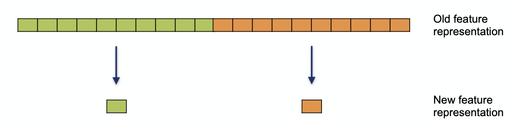
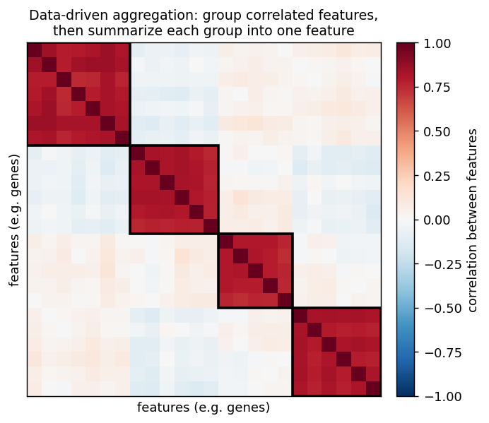

Feature aggregation
===================

Feature aggregation reduces dimensionality by **grouping the original features and
summarizing each group into a single aggregated feature**. Rather than building new
components from all the features at once, as feature transformation does, it first
partitions the features into groups and then replaces each group by one representative
value, for example the mean or median of its members. The outcome is a compact profile
with one value per group, which is far easier to visualize (as a heatmap, say) and to
feed into a downstream analysis than the original high-dimensional data.

   Each group of original features is collapsed into a single new feature, shrinking
   the representation from many features down to a handful.

How the groups are formed is what distinguishes the two approaches covered here:
**knowledge-based** aggregation, where the groups come from prior knowledge, and
**data-driven** aggregation, where the groups are discovered from the data itself.

Knowledge-based feature aggregation
-----------------------------------

In the knowledge-based approach the groups are fixed in advance from **external domain
knowledge**. The course example uses **gene sets from the Gene Ontology (GO)**, in
which each set collects the genes involved in one biological function, such as
photosynthesis. Summarizing the expression of all the genes in a function into a
single value turns a profile over many thousands of genes into a compact profile over
a few dozen high-level functions, which can then be inspected in a heatmap or used in
later machine-learning steps.

In matrix terms, an ``n x p`` table of samples by features is reduced to an
``n x l`` table of samples by feature groups, using an ``l x p`` membership assignment
that records which features belong to which group. The groups are allowed to
**overlap**, and a feature need not belong to any group at all. The summary itself is
computed with whatever aggregation function suits the data, the mean and median being
the usual choices. Because every aggregated feature corresponds to a named function,
the compact profile stays **directly interpretable**, which is the main attraction of
this approach.

Data-driven feature aggregation
-------------------------------

When no suitable grouping is known in advance, the groups can instead be **discovered
from the data** by clustering together features that behave similarly across the
samples. Here it is the *features* that are clustered rather than the samples, so the
data matrix is transposed first. Features that are strongly correlated fall into the
same cluster, and each cluster is then summarized into one aggregated feature.

   Clustering the features by similarity exposes blocks of mutually correlated
   features (outlined); each block is then summarized into a single aggregated
   feature.

The course clusters the features with **k-medoids**. Like the hierarchical clustering
often used to build heatmaps, k-medoids works only from **pairwise distances**, so it
applies to a wide range of data types, but it decides membership differently.
Hierarchical clustering merges items step by step and, once two are joined, never
separates them again. k-medoids instead **revises the assignment iteratively** by
*partitioning around medoids*, which tends to produce more homogeneous clusters. A
**medoid** is an actual data item, unlike the centroid in k-means, namely the feature
whose total distance to all the other members of its cluster is smallest. When the
number of features is large, the **CLARA** variant keeps this efficient by operating
on repeated samples of the data.

The two approaches trade interpretability against flexibility. Knowledge-based groups
are **easy to interpret**, since each aggregated feature maps onto a known function,
but they require that prior knowledge to exist and can only capture the structure that
this predefined grouping already describes. Data-driven groups need **no prior
knowledge** and adapt to whatever structure is present in the data, at the price of
clusters that may not line up with any established, readily named category.

References
----------

- Gene Ontology: `The Gene Ontology resource <https://geneontology.org>`_
- k-medoids and the CLARA extension: `Kaufman and Rousseeuw, "Finding Groups in Data" (VLDB 1994) <https://www.vldb.org/conf/1994/P144.PDF>`_
