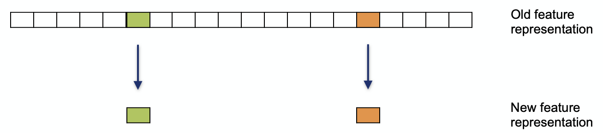
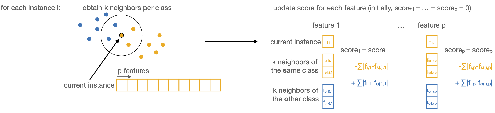
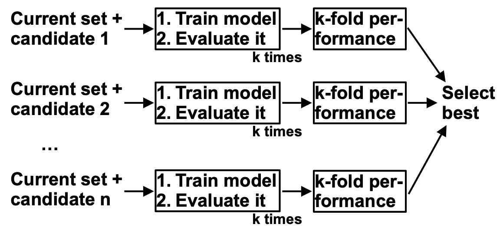

Feature selection
=================

Feature selection reduces dimensionality by **choosing a subset of the original
features and discarding the rest**. Unlike feature transformation and feature
aggregation, which build new features out of the old ones, feature selection keeps a
handful of the original features unchanged, so the reduced representation stays fully
interpretable in terms of the original measurements.

   A few of the original features are kept and the rest discarded; the new
   representation is a subset of the originals, not a combination of them.

While some feature-selection methods are unsupervised (variance-based filters, for
instance), feature selection is most often used in **supervised learning**, to keep
the features that best predict a target variable. The course illustrates every method
on the same task: predicting which of two tomato species a gene-expression sample
comes from, evaluated with a **leave-one-tissue-out** six-fold cross-validation (train
on five tissues, test on the sixth) so that the selected features are judged on their
ability to generalize to an unseen tissue. The methods come in three families, taken
in turn below: **filter**, **wrapper** and **embedded** methods.

Filter methods
--------------

Filter methods **score each feature, rank the features, and keep the top ones** (a
fixed number of them, or all that clear a threshold). The scoring is done up front,
independently of any particular classifier. The simplest filters are *univariate*,
testing each feature against the target on its own with a t-test or Wilcoxon test. The
course instead uses a more powerful *multivariate* filter, **ReliefF**, which scores
features using the k nearest neighbors of each sample computed from the whole feature
profile.

ReliefF builds a feature's score from the value differences between a sample and its
neighbors. For every sample it finds the k nearest neighbors of the **same** class and
the k nearest neighbors of the **other** class. A feature that differs strongly between
the sample and its same-class neighbors is penalized, since a good feature should be
consistent within a class, whereas a feature that differs strongly between the sample
and its other-class neighbors is rewarded, since that difference helps tell the classes
apart. Repeating this over every sample and summing the updates gives each feature its
final score, so that features which stay consistent within a class yet differ between
classes rise to the top.

   For each sample, ReliefF takes its k nearest neighbors in each class and updates
   every feature's score: differences to same-class neighbors lower the score,
   differences to other-class neighbors raise it.

ReliefF is a dimensionality-reduction step, not a classifier: it only proposes useful
features, and a separate model must then predict the class from them. In the course
example the single highest-scoring feature is passed to a one-node decision tree, which
finds a threshold *t* and predicts one species below it and the other above, and this
model is then tested on the held-out tissue. The top feature changes from fold to fold,
and the classification generalizes well to unseen tissues except when the root tissue
is the one held out.

Wrapper methods
---------------

Wrapper methods **search over subsets of features**, training and evaluating a model
for each candidate subset and keeping whichever subset scores best. Because the model
itself judges the features, the selection is tuned to that particular classifier.

The course uses **forward selection**, a greedy search that starts from an empty set
and adds one feature at a time. At each step it tries adding each feature not yet
chosen, measures the resulting model's validation performance, and permanently keeps
the single feature that helps the most, stopping once the set reaches the intended
size.

   One step of forward selection: each candidate feature is added to the current set
   in turn, every resulting model is scored by cross-validation, and the best-scoring
   candidate is kept.

To keep the validation data independent of the training data, forward selection is
wrapped in **nested cross-validation**, treating the feature set like a hyperparameter.
The inner loop selects the best feature set on the training data, aggregating over
several validation splits for robustness, while the outer loop measures how well that
selected set classifies genuinely unseen data. The outer test set must never be touched
during selection. **Backward elimination** is the mirror image, starting from all the
features and dropping the least useful one at each step. Greedy searches like these are
far cheaper than trying every possible subset, but they can miss the best combination
and may overfit the validation set, which is exactly why an independent test set
matters.

Embedded methods
----------------

Embedded methods **perform the selection while the model is being trained**, rather
than as a separate step beforehand. They add a **regularization** term to the model's
objective that steers it toward simpler, more generalizable solutions. The course
example is **elastic net**, a regularized regression that combines two penalties: an
**L1** penalty that drives many coefficients to exactly zero and so selects features,
and an **L2** penalty that shrinks the coefficients of correlated features toward one
another, so that correlated features tend to be kept or dropped together.

The model the course actually fits, elastic-net logistic regression, makes this
precise. Writing :math:`w` for the vector of feature coefficients and :math:`c` for the
intercept, training chooses them to minimize

.. math::

   \min_{w,\,c}\;\;
   C\sum_{i=1}^{n}\log\!\bigl(1+e^{-y_i(w^{\top}x_i+c)}\bigr)
   \;+\; \rho\,\lVert w\rVert_{1}
   \;+\; \tfrac{1-\rho}{2}\,\lVert w\rVert_{2}^{2}.

The first term is the data-fit (logistic) loss; the **L1** term
:math:`\lVert w\rVert_{1}=\sum_j |w_j|` is what forces coefficients to exactly zero and
so performs the selection, while the **L2** term
:math:`\lVert w\rVert_{2}^{2}=\sum_j w_j^{2}` shrinks the coefficients of correlated
features together. The ratio :math:`\rho` (the ``l1_ratio``, set to 0.5 in the course)
balances the two penalties, and :math:`C` controls the overall regularization strength,
a smaller :math:`C` meaning stronger regularization (the course uses :math:`C=0.1`).

Because the model is linear, its selected features split neatly into positive and
negative predictors of the class.

Comparing the approaches
------------------------

The three families trade computational cost against how tightly the selection is
coupled to the classifier. Filter methods are the fastest and classifier-agnostic,
scoring features before any model is trained, but a univariate filter can overlook
features that are only useful in combination. Wrapper methods put the classifier in the
loop and can therefore find complementary sets of features, at a much higher cost and
with a greater risk of overfitting. Embedded methods sit in between, selecting features
during training at a moderate cost, though the selection is tied to the specific
regularized model used.

References
----------

- General reviews: `Guyon and Elisseeff, 2003 (JMLR) <https://jmlr.csail.mit.edu/papers/volume3/guyon03a/guyon03a.pdf>`_; `feature selection in medical applications (Frontiers in Bioinformatics, 2022) <https://www.frontiersin.org/articles/10.3389/fbinf.2022.927312/full>`_
- ReliefF: `Robnik-Sikonja and Kononenko, 2003 <https://link.springer.com/content/pdf/10.1023/A:1008280620621.pdf>`_
- Elastic net: `Zou and Hastie, 2005 (Journal of Statistical Software) <https://www.jstatsoft.org/article/view/v033i01>`_
