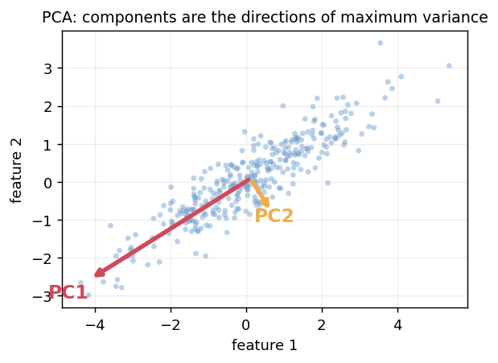
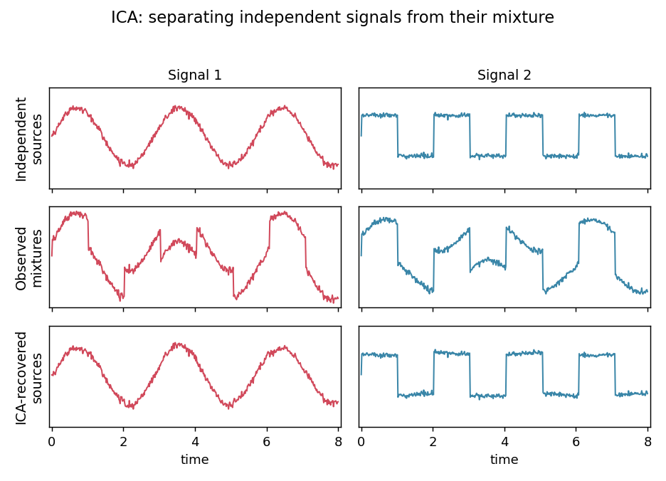
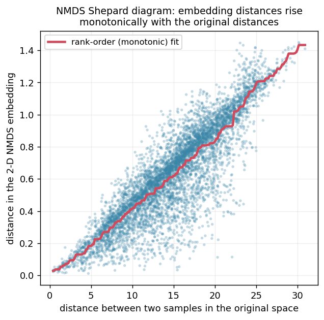
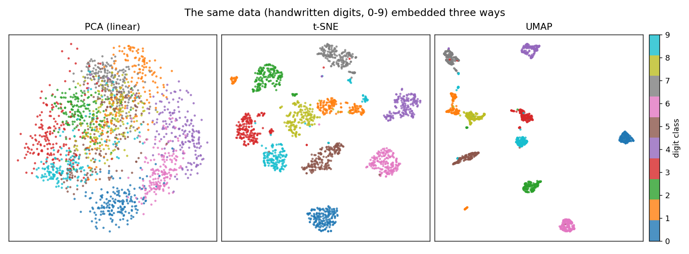

Feature transformation
======================

Feature transformation methods reduce dimensionality by mapping the original
features onto a smaller set of new features (*components*), each a combination of
the original ones. They are usually the first tool for exploring and visualizing
high-dimensional data, for example gene-expression data with tens of thousands of
features per sample, which cannot be inspected directly.

.. figure:: ../_figures/feature_transformation.png
   :align: center
   :width: 550px

   Each new component mixes the original features together; keeping only the first
   few of them gives a compact, lower-dimensional view of the data.

The methods on this page fall into two groups. The **linear** methods, PCA and ICA,
build every component as a plain weighted sum of the original features, which keeps
them fast and easy to interpret. The **nonlinear** methods, NMDS, t-SNE and UMAP,
can follow curved structure in the data and often expose clusters that the linear
methods blur together, at the cost of a less direct interpretation.

Principal component analysis (PCA)
----------------------------------

PCA is a **linear** method that finds orthogonal directions, called the *principal
components*, that capture as much of the data's variance as possible. Each component
is a linear combination of all the original features, and the components are ordered
by the amount of variance they explain, so the first few already give the best
low-dimensional summary of the dominant variation in the data.

   PCA finds orthogonal directions of maximum variance: PC1 captures the most, PC2
   the next most.

How many components to keep is usually decided from the **cumulative
explained-variance ratio**, retaining just enough of them to reach a chosen target,
for example 75 % of the total variance. Because PCA is **unsupervised** and uses no
class labels, it is a natural first step for visualization and quality control. One
caveat is worth keeping in mind: a direction of high variance is not automatically
the most meaningful one for the question at hand, since the largest variation in a
dataset can come from a technical or otherwise uninteresting source.

Independent component analysis (ICA)
------------------------------------

ICA is also **linear**, but it optimizes a different criterion. Rather than settling
for components that are merely *uncorrelated*, it looks for components that are
**statistically independent**, a considerably stronger condition, and it works best
when the underlying sources are non-Gaussian. The standard intuition is the
*source-separation* or "cocktail party" problem: reconstructing the individual
original signals, such as two voices recorded at the same time, from a set of
observed mixtures.

   ICA unmixes the observed mixtures back into their independent sources.

Two consequences follow from this goal. Because the components are no longer tied to
variance, ICA imposes **no inherent ordering** on its outputs, and the exact result
can shift with the random initialization. In return, it can pull apart overlapping
effects **regardless of how much variance each one contributes**, which frequently
yields components that are easier to interpret than PCA's.

PCA vs. ICA
-----------

Although both methods are linear, they answer different questions. PCA preserves as
much **variance** as possible and returns uncorrelated, ordered components, which
surfaces the most dominant effects in the data. ICA instead recovers statistically
**independent** sources, which tends to separate distinct underlying processes and
is often more interpretable, even when some of those processes contribute little
variance. As a rule of thumb, reach for PCA to summarize and compress, and for ICA
when you suspect the data is a mixture of separable signals that you want to tease
apart.

Non-metric multidimensional scaling (NMDS)
------------------------------------------

Multidimensional scaling takes a different starting point. Instead of the feature
values themselves, it works from the **pairwise distances** between samples and tries
to place those samples in a low-dimensional display (usually 2-D) so that the
distances are reproduced as faithfully as possible. The **non-metric** variant, NMDS,
relaxes this further and preserves only the **rank order** of the distances, which
permits more general nonlinear transformations and makes it robust when only the
ordering of the dissimilarities can be trusted.

The quality of the layout is captured by the **stress**, a number that measures how
well the display distances match the original rank order, where 0 is a perfect fit
and values up to roughly 0.1 are usually acceptable. Preserving the global ordering
of distances does not, however, guarantee that the *local* neighborhoods are
trustworthy, so it is good practice to cross-check them with a neighborhood
contingency table.

   A Shepard diagram checks the fit: every point is a pair of samples, and NMDS keeps
   the embedding distances rising monotonically with the original distances. The
   stress measures how much the points scatter around this rank-order trend.

t-Distributed stochastic neighbor embedding (t-SNE)
---------------------------------------------------

t-SNE is a **nonlinear** method built to **preserve local structure at several scales
at once**, which lets it reveal fine-grained clusters that PCA tends to blur
together. Its main parameter, the **perplexity**, can be read intuitively as the
effective number of neighbors that each point is drawn toward.

These strengths come with clear limitations. t-SNE learns **no reusable mapping**, so
new points cannot be added to an existing embedding without re-running the whole
optimization. Its outcome also depends on the random initialization and can settle
into different **local minima**, which is why running it several times is advisable.
It further distorts **global** structure, so the distances between clusters carry
little meaning, and it scales poorly beyond three embedding dimensions. For all these
reasons t-SNE is best treated as a tool for **visualization only**, rather than as a
preprocessing step for downstream machine learning.

Uniform manifold approximation and projection (UMAP)
----------------------------------------------------

UMAP first builds a **k-nearest-neighbor graph** of the data and then computes a
low-dimensional **layout** that keeps the structure of that graph. It pursues much
the same goal as t-SNE but brings two practical advantages: it is **considerably
faster** and scales comfortably to very large, high-dimensional datasets, and it
places **no restriction on the number of embedding dimensions**, so its output can
feed a later machine-learning step instead of serving only as a picture. The price is
a handful of approximations made for speed, for example in the nearest-neighbor
search, so on small datasets it is worth confirming that neighborhoods are preserved
and repeating the analysis with a few random seeds.

Choosing a method
-----------------

Seeing the methods side by side helps in choosing between them. The figure below
reduces the same dataset with PCA, t-SNE and UMAP: the linear PCA leaves the classes
overlapping, while the nonlinear t-SNE and UMAP separate them into distinct groups.

   The same handwritten-digit data reduced to two dimensions three ways. PCA keeps the
   digit classes overlapping; t-SNE and UMAP pull them apart into clear clusters.

The table below summarizes, at a glance, which method tends to fit which task and
whether it can project new samples onto an existing embedding.

.. list-table::
   :header-rows: 1
   :widths: 20 15 22 43

   * - Method
     - Type
     - Projects new points?
     - Typical use
   * - PCA
     - linear
     - yes
     - First exploration, quality control, preprocessing
   * - ICA
     - linear
     - yes
     - Separating independent underlying signals
   * - NMDS
     - nonlinear
     - no
     - Distance-preserving visualization
   * - t-SNE
     - nonlinear
     - no
     - Local-structure visualization (visualization only)
   * - UMAP
     - nonlinear
     - yes
     - Visualization *and* preprocessing for machine learning

Optional material
-----------------

The course notebook also covers two topics that go beyond the five methods above. The
first is **canonical correlation analysis (CCA)**, a linear method for the case where
each sample is described by **two** paired sets of features, for instance the same
patients measured on two different platforms. Rather than maximizing the variance
within a single table, CCA looks for the directions in each set that are **most
strongly correlated with each other**, which brings out the shared signal that the
two views of the data have in common. The second topic is a family of
feature-transformation methods adapted to **binary data**, for which the usual
assumptions behind PCA no longer hold.

.. figure:: ../_figures/cca.png
   :align: center
   :width: 500px

   CCA works with two paired feature sets and finds the directions in each that are
   most strongly correlated, exposing the structure the two sets share.

See the course notebook for worked examples of both.

References
----------

- PCA: `Introduction to PCA (OpenCV) <https://docs.opencv.org/4.x/d1/dee/tutorial_introduction_to_pca.html>`_; `introductory paper <https://onlinelibrary.wiley.com/doi/full/10.1111/test.12363>`_
- ICA: `ICA survey <http://www.cse.msu.edu/~cse902/S03/icasurvey.pdf>`_; `illustrative tutorial <https://arxiv.org/pdf/1404.2986>`_
- NMDS: `Sammon mapping and MDS variants <http://www.biomedcentral.com/1471-2105/4/48>`_; `scikit-learn MDS documentation <https://scikit-learn.org/stable/modules/generated/sklearn.manifold.MDS.html>`_
- t-SNE: `van der Maaten and Hinton, 2008 <https://www.jmlr.org/papers/volume9/vandermaaten08a/vandermaaten08a.pdf>`_
- UMAP: `McInnes et al., 2018 <https://arxiv.org/pdf/1802.03426.pdf>`_
