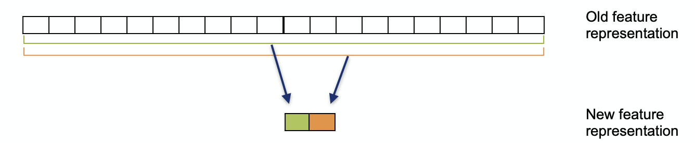
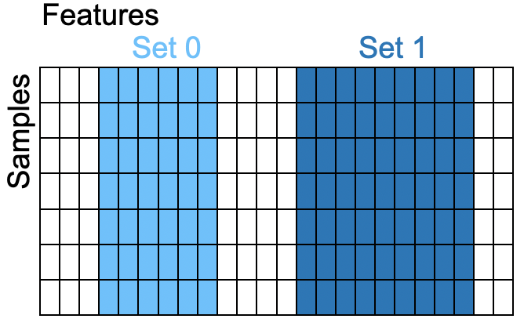

Feature transformation
======================

Feature transformation methods reduce dimensionality by mapping the original
features onto a smaller set of new features (*components*), each a combination of
the original ones. They are usually the first tool for exploring and visualizing
high-dimensional data — for example, gene-expression data with tens of thousands
of features per sample, which cannot be inspected directly.

This page summarizes the methods used in the course: the **linear** methods PCA and
ICA, and the **nonlinear** methods NMDS, t-SNE and UMAP.

Principal component analysis (PCA)
----------------------------------

PCA is a **linear** method that finds orthogonal directions — the *principal
components* — that capture as much of the data's variance as possible. Each
component is a linear combination of all original features, and the components are
ordered by the amount of variance they explain, so the first few give the best
low-dimensional summary of the dominant variation in the data.

- The **cumulative explained-variance ratio** is commonly used to decide how many
  components to keep (e.g. enough to retain 75 % of the variance).
- PCA is **unsupervised** and a natural first step for visualization and quality
  control.
- A caveat: high variance does not automatically mean the component is meaningful
  for the question at hand.

Independent component analysis (ICA)
------------------------------------

ICA is also **linear**, but optimizes a different criterion: instead of merely
*uncorrelated* components, it seeks **statistically independent** components — a
stronger condition — and is well suited to non-Gaussian sources. The classic
intuition is the *source-separation* ("cocktail party") problem: recovering
independent original signals (e.g. two voices) from observed mixtures.

- Unlike PCA, the components have **no inherent order** and depend on the random
  initialization.
- ICA can separate overlapping effects **regardless of their variance**, which
  often yields more interpretable components.

PCA vs. ICA
-----------

Both are linear, but with different goals:

- **PCA** preserves maximum **variance** and produces uncorrelated, ordered
  components — it surfaces the most dominant effects in the data.
- **ICA** recovers statistically **independent** sources — it tends to separate
  distinct underlying processes and is often more interpretable, even when those
  processes are low-variance.

Non-metric multidimensional scaling (NMDS)
------------------------------------------

The first **nonlinear** method. Multidimensional scaling aims to **preserve the
pairwise distances** between samples when placing them in a low-dimensional
(usually 2-D) display. The *non-metric* variant preserves only the **rank order**
of the distances, which allows more general nonlinear transformations.

- Its objective — the **stress** — measures how well the display distances match
  the original rank order (0 = perfect fit, up to ~0.1 is acceptable).
- Preserving the global distance order does **not** guarantee trustworthy *local*
  neighborhoods, which can be checked with a neighborhood contingency table.

t-Distributed stochastic neighbor embedding (t-SNE)
---------------------------------------------------

t-SNE is a **nonlinear** method designed to **preserve local structure at multiple
scales**, revealing fine-grained clusters that PCA can miss. Its **perplexity**
parameter can be read as the effective number of neighbors of each point.

Key limitations:

- It provides **no learned mapping**, so new data points cannot be projected
  without re-running the optimization.
- Results depend on the random initialization (**local minima**) — several runs
  are advisable.
- It distorts **global** structure (cluster distances are unreliable) and scales
  poorly beyond three embedding dimensions.

t-SNE is therefore a tool for **visualization only**, not a preprocessing step for
downstream machine learning.

Uniform manifold approximation and projection (UMAP)
----------------------------------------------------

UMAP constructs a **k-nearest-neighbor graph** of the data and computes a
low-dimensional **layout** of that graph.

- It is **much more efficient than t-SNE** and scales to very large,
  high-dimensional datasets.
- Unlike t-SNE, it has **no restriction on the number of embedding dimensions**,
  so it can serve as a dimensionality-reduction step *before* machine learning.
- It makes some approximations for speed (e.g. in the nearest-neighbor search), so
  for small datasets it is worth checking neighborhood preservation and repeating
  the analysis with several random seeds.

Choosing a method
-----------------

.. list-table::
   :header-rows: 1
   :widths: 20 15 22 43

   * - Method
     - Type
     - Projects new points?
     - Typical use
   * - PCA
     - linear
     - yes
     - First exploration, quality control, preprocessing
   * - ICA
     - linear
     - yes
     - Separating independent underlying signals
   * - NMDS
     - nonlinear
     - no
     - Distance-preserving visualization
   * - t-SNE
     - nonlinear
     - no
     - Local-structure visualization (visualization only)
   * - UMAP
     - nonlinear
     - yes
     - Visualization *and* preprocessing for machine learning

Optional material
-----------------

The course notebook also covers **canonical correlation analysis (CCA)** — a linear
method that finds directions of maximum correlation between two paired sets of
features — and feature-transformation methods for **binary data**. See the notebook
for these optional topics.

References
----------

- PCA — `Introduction to PCA (OpenCV) <https://docs.opencv.org/4.x/d1/dee/tutorial_introduction_to_pca.html>`_; `introductory paper <https://onlinelibrary.wiley.com/doi/full/10.1111/test.12363>`_
- ICA — `ICA survey <http://www.cse.msu.edu/~cse902/S03/icasurvey.pdf>`_; `illustrative tutorial <https://arxiv.org/pdf/1404.2986>`_
- NMDS — `Sammon mapping / MDS variants <http://www.biomedcentral.com/1471-2105/4/48>`_; `scikit-learn MDS documentation <https://scikit-learn.org/stable/modules/generated/sklearn.manifold.MDS.html>`_
- t-SNE — `van der Maaten & Hinton, 2008 <https://www.jmlr.org/papers/volume9/vandermaaten08a/vandermaaten08a.pdf>`_
- UMAP — `McInnes et al., 2018 <https://arxiv.org/pdf/1802.03426.pdf>`_
