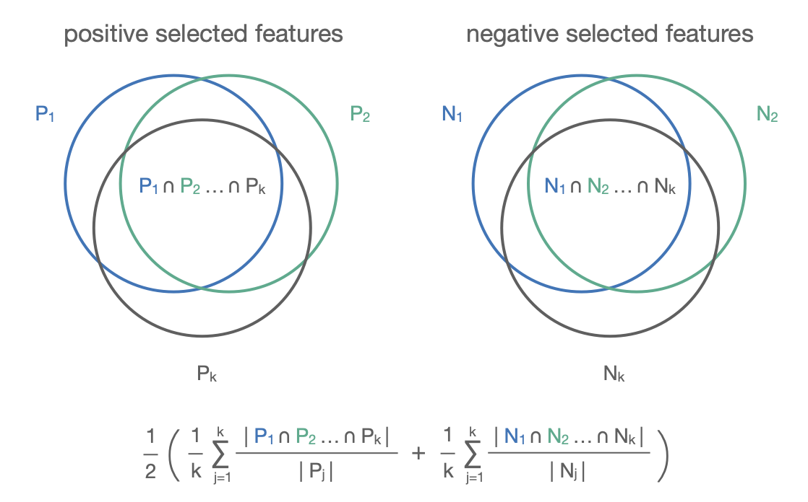
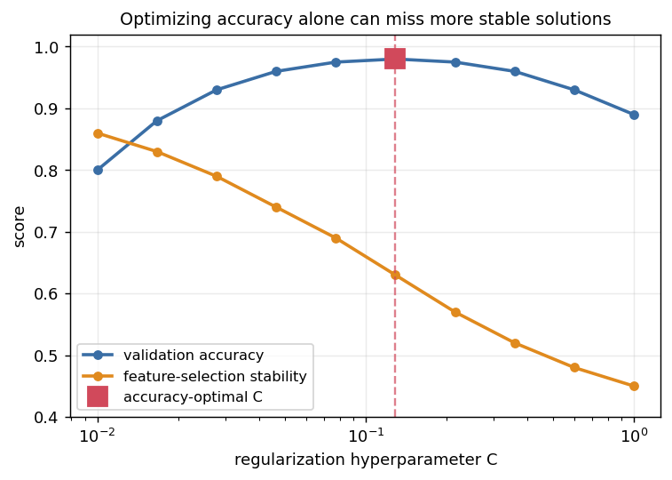

Stability and optimization
==========================

This final topic builds on feature selection. A feature-selection result is more
trustworthy and easier to interpret when it is **stable**: a small change in the
training data should not lead to an entirely different set of selected features. This page introduces a simple way to measure that
stability and then shows how to bring it into hyperparameter optimization, instead of
optimizing prediction accuracy on its own.

Measuring stability
-------------------

When feature selection is repeated across **k models**, for example the k folds of a
cross-validation, its stability can be summarized by how much the selected sets
**overlap**. The measure used in the course compares the **overall intersection** of
the selected features against the size of each individual model's selection, computed
separately for the positive and the negative predictors and then averaged.

   Each of the k models selects a set of positive predictors (P\ :sub:`1` ... P\
   :sub:`k`) and negative predictors (N\ :sub:`1` ... N\ :sub:`k`). The stability is the
   average fraction of each model's selection that falls in the common intersection.

A value of 1 means every model selects exactly the same features, that is, perfectly
stable selection, while a low value means the chosen features change substantially from
one training set to the next.

Hyperparameter optimization
---------------------------

When a result is not satisfactory, the usual remedy is to **optimize the model's
hyperparameters on validation data**, typically by nested cross-validation, the same
inner-and-outer split used for wrapper feature selection. For the elastic-net
classifier the hyperparameter of interest is the regularization strength ``C``, and the
standard optimization criterion is the **validation accuracy**.

Balancing accuracy and stability
--------------------------------

Optimizing accuracy on its own, however, can leave stability on the table. Tracking
both measures across values of ``C`` shows that the accuracy-optimal ``C`` is often
**not** the most stable one, and that a different ``C`` can give more stable feature
selection at essentially the same accuracy.

   Validation accuracy peaks at the marked ``C``, but feature-selection stability keeps
   falling as ``C`` grows, so a smaller ``C`` in the high-accuracy region yields more
   stable selections at almost the same accuracy (illustrative curves).

This motivates a **stability-aware** criterion. Replacing accuracy with the **sum of
accuracy and stability** makes the search prefer the more stable solutions, and in the
course example it then consistently picks the most stable ``C`` while keeping the test
accuracy perfect. Even so, the average validation stability can remain moderate (below
0.7 in that example), which is itself informative: it signals that **many alternative
feature sets** solve the task about equally well, a redundancy that is common in
high-dimensional biological data.

On harder problems the two goals genuinely compete. Restricting the task to a smaller
pool of candidate genes, the same combined criterion can push stability up to around
0.9, but only at the cost of some validation and test accuracy. Which balance to strike
between accuracy and stability is then a deliberate modeling choice.

In practice
-----------

Hyperparameter optimization needs enough data to be reliable. On a small dataset like
the course's, the optimized ``C`` varies from run to run, so the median across runs is
a reasonable summary, and it is often safer to keep a sensible predefined value than to
over-optimize and risk overfitting the validation set.

The broader lesson is that **accuracy is not always the only thing worth optimizing**.
For feature selection a degree of stability is usually just as desirable, so that the
features a model reports can be trusted rather than being an artifact of one particular
training split.

References
----------

- Stability quantification: `Nogueira, Sechidis and Brown, 2017 (JMLR) <https://www.jmlr.org/papers/volume18/17-514/17-514.pdf>`_
- An importance-weighted stability measure: `Nogueira, Sechidis and Brown, 2021 (JMLR) <https://jmlr.org/papers/volume22/20-366/20-366.pdf>`_
